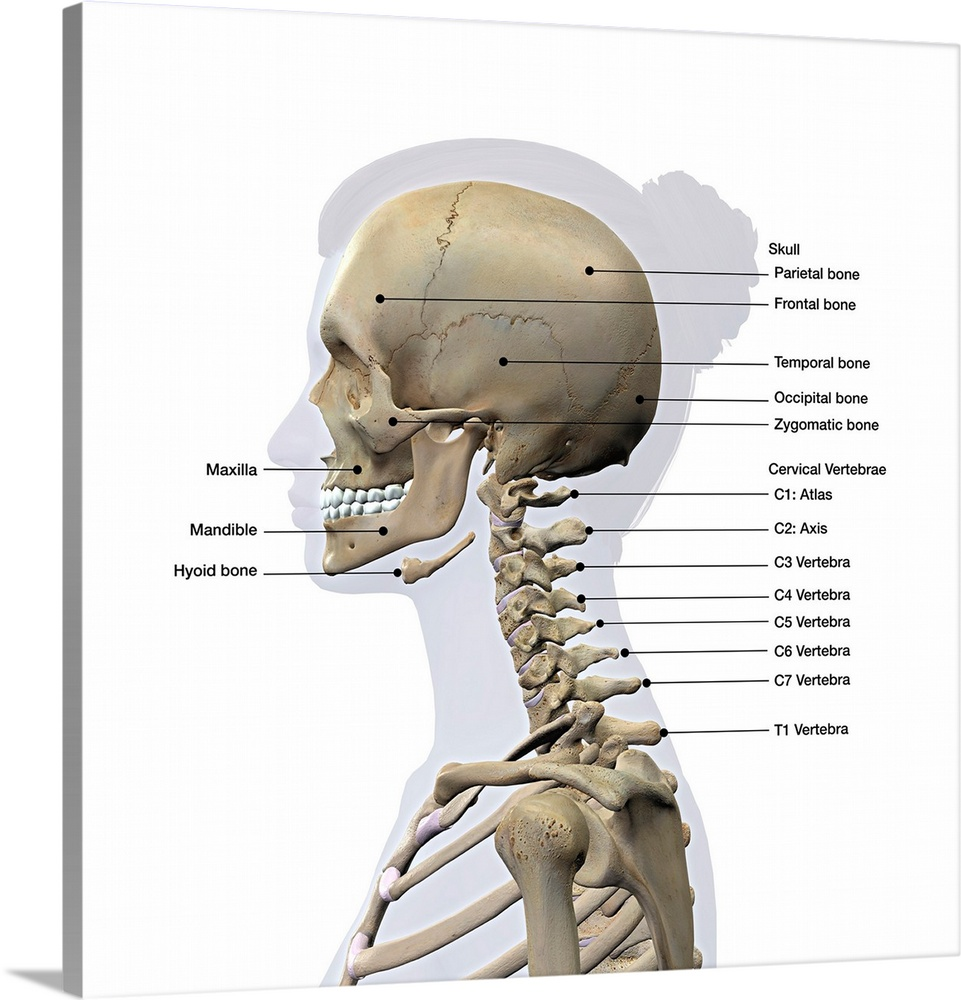

**DIAGNOSIS OF CERVICAL SPINE FRACTURES BY CNN**

The most common spine fracture is the cervical spine. The cervical spine consists of 7 vertebrae.

  

It is essential to quickly detect and determine the location of any vertebra fractures to prevent neurologic deterioration and paralysis after trauma. 
In the elderly, because of superimposed degenerative disease and osteoporosis, detecting fractures on imaging can be more difficult.

This research focuses on creating a deep learning-based model to detect fractures in CT scans.

